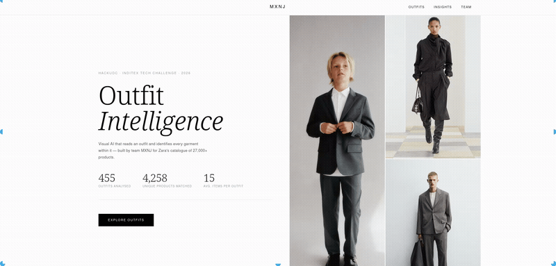
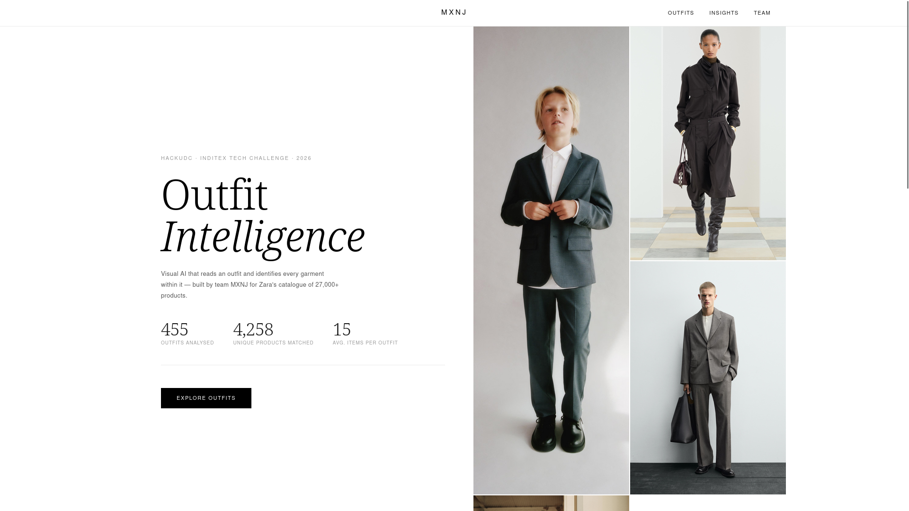
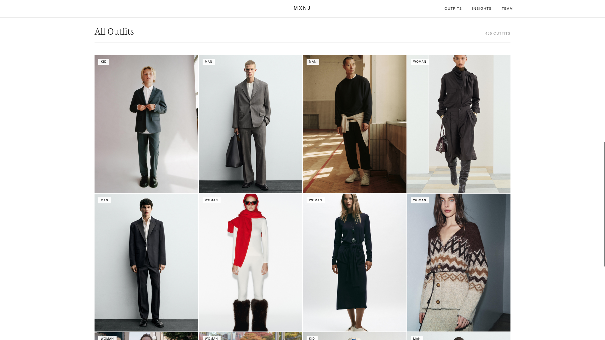
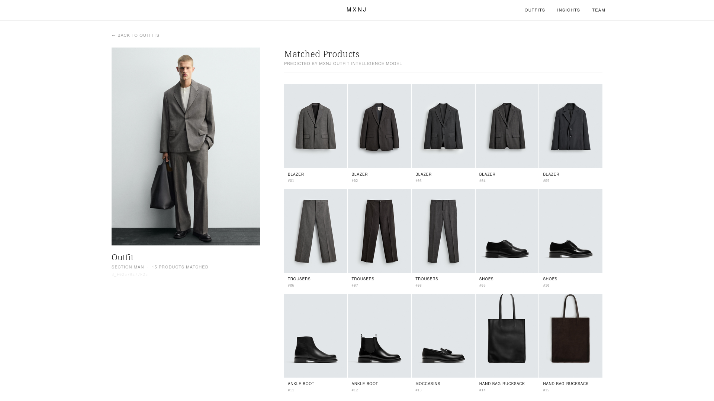

# MXNJ — Fashion Visual Product Recognition

<p align="center">
  
</p>

> **Given a fashion photograph, identify every garment being worn and return the matching product references from a catalogue.** Built entirely on open-source models — zero closed-source APIs.

**HackUDC 2026 · INDITEXTECH Challenge · 69.66% Recall@15**  
Team: Xoel García Maestu · Jacobo Núñez Álvarez · Nicolás Aller Ponte · Miguel Planas Díaz

---

## Table of Contents

- [What does it do?](#what-does-it-do)
- [Open Source AI Stack](#open-source-ai-stack)
- [Pipeline Architecture](#pipeline-architecture)
- [Demo](#demo)
- [Repository Structure](#repository-structure)
- [Installation](#installation)
- [Running the Pipeline](#running-the-pipeline)
- [Running the Demo](#running-the-demo)
- [Results](#results)
- [Contributing](#contributing)
- [License](#license)

---

## What does it do?

Given a *bundle* — a fashion photo with one or more models — the system:

1. **Detects** every person and segments their body into anatomical zones (head, torso, legs, feet)
2. **Embeds** each zone using state-of-the-art open-source vision models
3. **Fine-tunes** those embeddings on the specific clothing domain using contrastive learning
4. **Retrieves** the top-15 most similar products from a 27k-item catalogue
5. **Ranks** candidates using visual similarity + business heuristics (timestamps, SKU prefixes, co-occurrence)

The key innovation is a **semi-supervised B2B self-expansion loop** that uses the model's own high-confidence predictions on test data to iteratively enrich the retrieval index — without any additional labels.

---

## Open Source AI Stack

Every model, framework and tool in this project is 100% open source. No OpenAI, no Gemini, no closed APIs.

| Model | Source | Purpose | Dimensions |
|---|---|---|---|
| **YOLOv8x-seg** | [Ultralytics (AGPL-3.0)](https://github.com/ultralytics/ultralytics) | Person detection & anatomical segmentation | — |
| **SigLIP SO400M/384** | [OpenCLIP (MIT)](https://github.com/mlfoundations/open_clip) | Primary visual embeddings | 1152d |
| **DINOv2 ViT-L/14** | [timm / Meta (Apache 2.0)](https://github.com/huggingface/pytorch-image-models) | Ensemble visual embeddings | 1024d |
| **PyTorch** | [pytorch.org (BSD-3)](https://github.com/pytorch/pytorch) | Training, inference, DataParallel | — |

### Why these models?

- **SigLIP** uses a sigmoid loss instead of softmax, scaling better to large datasets and producing tighter visual representations — ideal for fine-grained clothing matching.
- **DINOv2** learns rich spatial and structural features through self-supervised learning, capturing texture and geometry that SigLIP misses. Together they form a complementary ensemble.
- **YOLOv8x-seg** provides precise body masks that allow region-specific matching, eliminating background noise that would otherwise confuse the embedding models.

### Fine-tuning approach

We do not call any model as a black box. We train a **Projection Head** on top of both SigLIP and DINOv2 using:

- **InfoNCE (contrastive) loss** with in-batch negatives (batch size 1024 → 1023 negatives per example)
- **Triplet Margin Loss** with explicit hard negative mining from the top-200 visually similar non-matching products
- **5-Fold cross-validation** with early stopping (patience=5), ensemble of the 3 best folds
- **OneCycleLR scheduler** with cosine annealing and 2 warmup epochs

```
L_total = L_InfoNCE + 0.5 × L_Triplet
```

This moves the generic pretraining space into a domain-specific Inditex fashion space, without touching the backbone weights — making it reproducible on modest hardware.

---

## Pipeline Architecture

```
Bundle Image
     │
     ▼
┌─────────────────────────────────────────────────────┐
│ Block 1 · Data Engineering & Hard Constraints        │
│  · SKU + timestamp extraction from image URLs        │
│  · Noise filter: 40+ irrelevant categories removed   │
│  · Section constraints learned from train labels     │
└─────────────────────────┬───────────────────────────┘
                          │
                          ▼
┌─────────────────────────────────────────────────────┐
│ Block 2 · YOLOv8x-seg Anatomical Segmentation        │
│  · Person detection (conf > 0.3)                     │
│  · 5 crops per bundle:                               │
│    HEAD (0–20%) · TORSO (18–55%) · LEGS (50–85%)     │
│    FEET (80–100%) · GLOBAL (full image)              │
│  · Fallback proportional crops when no person found  │
└─────────────────────────┬───────────────────────────┘
                          │
                          ▼
┌─────────────────────────────────────────────────────┐
│ Block 3 · SigLIP SO400M 384px Embeddings             │
│  · Batch size 256, DataParallel (2× T4)              │
│  · L2-normalized, 1152d per crop                     │
├─────────────────────────────────────────────────────┤
│ Block 3.5 · DINOv2 ViT-L/14 Embeddings              │
│  · Same batching strategy, 1024d per crop            │
│  · Serialized to embeddings_55.pkl for reuse         │
└─────────────────────────┬───────────────────────────┘
                          │
                          ▼
┌─────────────────────────────────────────────────────┐
│ Block 4 · Contrastive Fine-Tuning (K-Fold)           │
│  4.1 SigLIP Projection Head: 1152→2048→2048→1152     │
│  4.2 DINOv2 Projection Head: 1024→1536→1536→1024     │
│  Both: InfoNCE + Triplet · AdamW · OneCycleLR        │
│  Ensemble = average of 3 best folds (lowest val loss)│
└─────────────────────────┬───────────────────────────┘
                          │
                          ▼
┌─────────────────────────────────────────────────────┐
│ Block 5 · The Beast Search Engine                    │
│  · TOP-2000 candidates per anatomical zone           │
│  · B2B: 25 most similar train bundles as references  │
│  · Scoring: 85% SigLIP + 15% DINOv2                 │
│  · Boosts: timestamp · SKU prefix · co-occurrence    │
│  · Semi-supervised B2B self-expansion (4 passes)     │
│  · Deduplication: SKU-10 base + per-category cap     │
└─────────────────────────┬───────────────────────────┘
                          │
                          ▼
              submissions/submission.csv
              (Top-15 products per bundle)
```

---

## Demo

A standalone web app that visualises the pipeline results on the test set.

|  |  |  |
|:---:|:---:|:---:|
| Home | Bundle gallery | Prediction detail |

Swap any `submission.csv` into `demo/data/` and restart to explore different model versions.

---

## Repository Structure

```
HackUDC2026/
├── submission_solution.ipynb   ← Full pipeline (final solution, well-commented)
├── other_solution.ipynb        ← Alternative experiments
├── requirements.txt            ← Unified dependencies
├── Pipfile / Pipfile.lock      ← pipenv environment
├── LICENSE                     ← GPLv3 License
├── CONTRIBUTING.md             ← Contribution guide
├── submissions/
│   ├── submission.csv          ← Best submission (69.66%)
│   └── old_submissions/        ← Full version history (V2 → V12)
└── demo/
    ├── main.py                 ← FastAPI backend
    ├── data/
    │   ├── bundles.csv
    │   ├── products.csv
    │   └── submission.csv
    ├── templates/index.html
    └── static/
        ├── css/style.css
        └── js/app.js
```

---

## Installation

### Requirements

- Python 3.12
- `pipenv` — `pip install pipenv`
- CUDA-capable GPU recommended. CPU works for the demo and for small-scale experiments.

### 1. Clone

```bash
git clone https://github.com/your-org/HackUDC2026.git
cd HackUDC2026
```

### 2. Create the virtual environment

```bash
pipenv --python 3.12
```

### 3. Install PyTorch (CUDA 11.8)

PyTorch must be installed separately because it needs its own package index:

```bash
pipenv run pip install torch==2.10.0 torchvision==0.25.0 \
    --index-url https://download.pytorch.org/whl/cu118
```

> **No GPU?** Skip `--index-url ...` and pip installs the CPU build. The demo runs fine on CPU; the full training pipeline will be slow but functional.

### 4. Install the rest of the dependencies

```bash
pipenv install -r requirements.txt
```

### 5. Verify

```bash
pipenv run python -c "import torch; print(torch.cuda.get_device_name(0))"
pipenv run python -c "import open_clip, timm, ultralytics; print('All good')"
```

---

## Running the Pipeline

The full solution lives in `submission_solution.ipynb`, structured as six clearly labelled blocks. It is designed for **Kaggle (2× T4)** but works on any CUDA machine.

### Prepare data

Place the challenge CSVs where Block 1 expects them:

```
/kaggle/working/           ← default Kaggle path (edit WORK_DIR in Block 1 to change)
  ├── bundles_dataset.csv
  ├── product_dataset.csv
  ├── bundles_product_match_train.csv
  └── bundles_product_match_test.csv
```

### Run

```bash
pipenv run jupyter notebook submission_solution.ipynb
```

Execute blocks in order (1 → 2 → 3 → 3.5 → 4.1 → 4.2 → 5). Block 5 writes the final output to `submissions/submission.csv`.

**Approximate VRAM per block:**

| Block | Operation | VRAM |
|---|---|---|
| 2 | YOLOv8x inference | ~2 GB |
| 3 | SigLIP embedding extraction | ~6 GB |
| 3.5 | DINOv2 embedding extraction | ~8 GB |
| 4.1 / 4.2 | Fine-tuning, batch 1024 | ~12 GB |
| 5 | Search engine (NumPy, CPU) | — |

---

## Running the Demo

The demo is a self-contained FastAPI app — the full pipeline is not required.

### 1. Copy the submission

```bash
cp submissions/submission.csv demo/data/submission.csv
```

### 2. Start the server

```bash
cd demo
pipenv run uvicorn main:app --reload --port 8000
```

Open **http://localhost:8000**.

### API

| Method | Path | Description |
|---|---|---|
| `GET` | `/` | Main app |
| `GET` | `/api/bundles?page=1&size=12` | Paginated bundle list |
| `GET` | `/api/bundle/{id}` | Bundle detail + top-15 predictions |
| `GET` | `/api/stats` | Aggregate metrics |

---

## Contributing

Contributions are welcome. This project is GPLv3-licensed and built to be extended by the community.

### Good First Issues

These are well-scoped improvements that don't require deep knowledge of the pipeline:

- [ ] **CPU-only mode** — add a flag to skip DataParallel so the pipeline runs without a GPU
- [ ] **Config file** — extract hardcoded hyperparameters (batch sizes, TOP_K, boost weights) into `config.yaml`
- [ ] **Docker image** — create a `Dockerfile` for the demo so it can be deployed with one command
- [ ] **Standalone script** — convert the notebook into `pipeline.py` with `argparse` for CLI usage
- [ ] **Evaluation script** — standalone `evaluate.py` that computes Recall@K for any CSV against a ground truth file
- [ ] **DINOv2 weight tuning** — experiment with raising the DINOv2 weight above 15% in the ensemble and report results

### Workflow

```bash
# 1. Fork and clone
git clone https://github.com/YOUR_USERNAME/HackUDC2026.git
cd HackUDC2026

# 2. Create a branch
git checkout -b feature/your-feature-name

# 3. Set up environment (see Installation above)

# 4. Commit and push
git commit -m "feat: describe your change"
git push origin feature/your-feature-name

# 5. Open a Pull Request
```

### Code style guidelines

- **Notebooks**: every block must have a markdown header explaining what it does and why — keep them readable as documentation.
- **Python files**: PEP 8; one-line docstring on every function.
- **New dependencies**: add to `requirements.txt` with a pinned version and a comment.
- **Issues**: include Python version, OS, GPU model (if applicable) and the full error traceback.

---

## License

Released under the **GNU General Public License v3.0** — see [LICENSE](LICENSE). You are free to use, study, share and modify this software, provided that any derivative work is also distributed under GPLv3.

**Dependency licenses:**

| Library | License |
|---|---|
| This project | GPLv3 |
| Ultralytics / YOLOv8 | AGPL-3.0 |
| OpenCLIP / SigLIP | MIT |
| timm / DINOv2 | Apache 2.0 |
| PyTorch | BSD-3-Clause |
| FastAPI | MIT |

---

*HackUDC 2026 · INDITEXTECH Challenge · Team MXNJ*